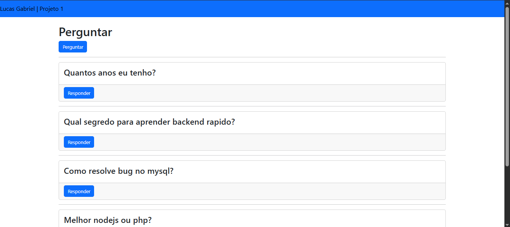
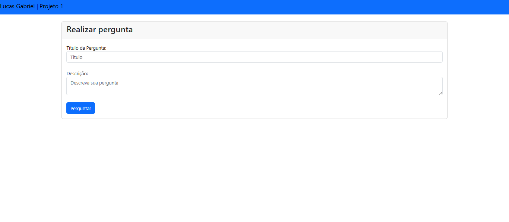
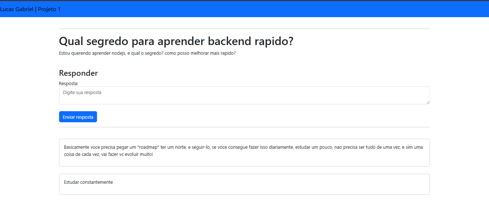

# Perguntas e Respostas

Sistema web de perguntas e respostas, desenvolvido com Node.js, EJS e Bootstrap.

## 🔍 Sobre

Este projeto é um sistema completo onde os usuários podem:

- Visualizar todas as perguntas já cadastradas
- Cadastrar novas perguntas
- Responder perguntas existentes

## 🚀 Tecnologias utilizadas

- **Node.js** (back-end)
- **EJS** (template engine)
- **Bootstrap** (estilização)

## 📁 Estrutura das páginas

- **Página principal**: exibe todas as perguntas cadastradas no banco de dados.
- **Página de cadastro de perguntas**: permite que o usuário envie uma nova pergunta.
- **Página de respostas**: exibe uma pergunta específica e permite adicionar respostas.

## ▶️ Como rodar o projeto

1. **Clone o repositório**
   ```bash
   git clone https://github.com/purpesy/PerguntasRespostas.git
   cd PerguntasRespostas
   ```

2. **Instale as dependências**
   ```bash
   npm install
   ```

3. **Inicie o servidor**
   ```bash
   npm start
   ```

4. **Acesse no navegador**
   ```
   http://localhost:3000
   ```

> ⚠️ Certifique-se de ter o Node.js e o npm instalados na máquina.

## 📌 Status do projeto

✅ Projeto **concluído**

## 🖼️ Telas do Projeto

### Página Inicial


### Página de Perguntas


### Página de Respostas



## 👨‍💻 Autor

Feito por [Lucas](https://github.com/purpesy)
